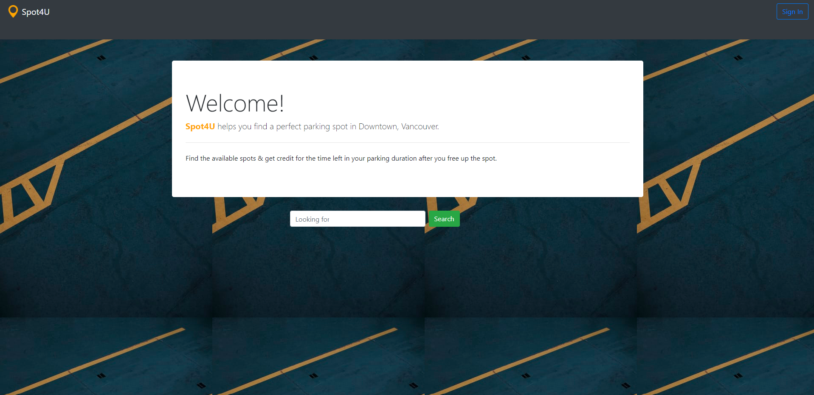
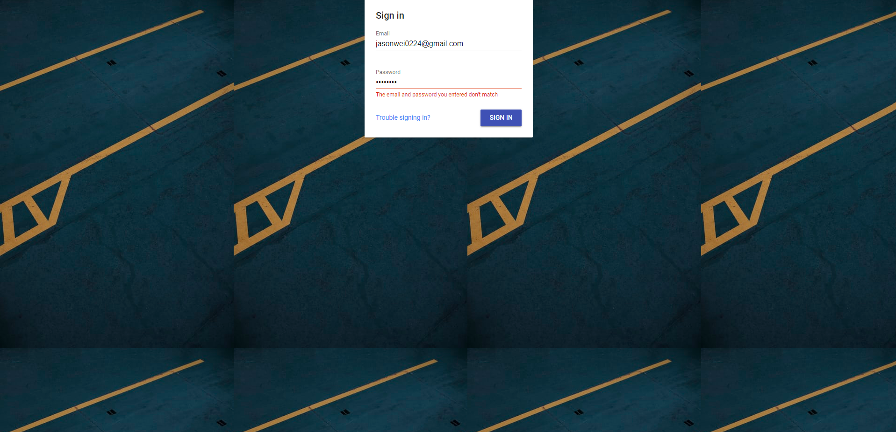
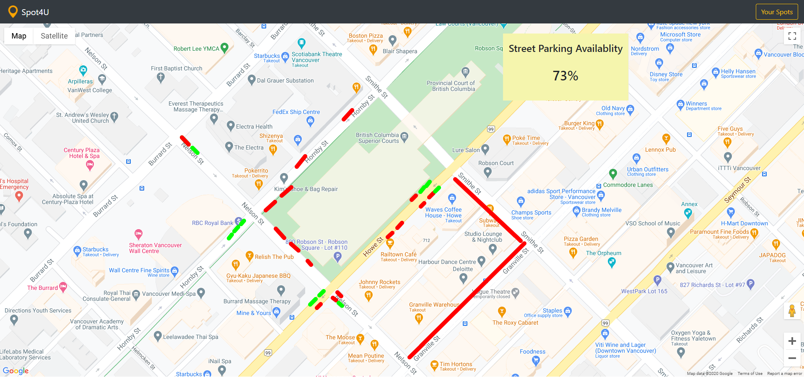
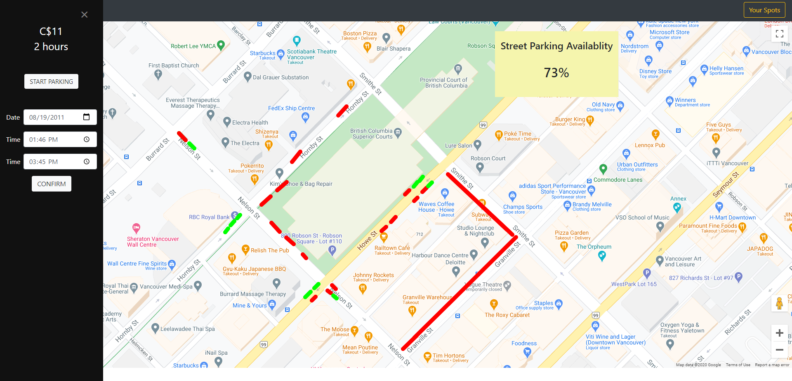
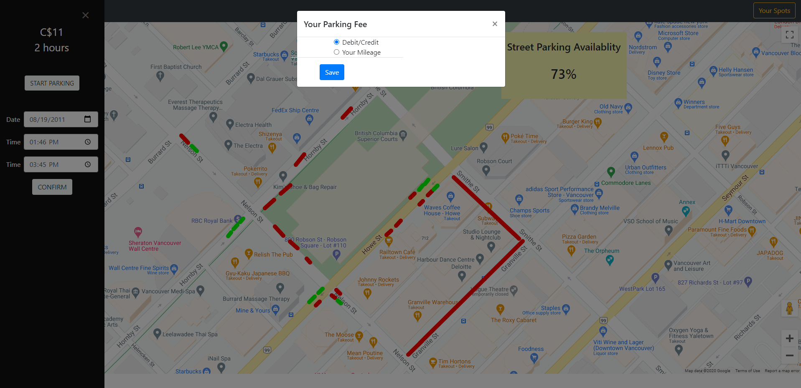
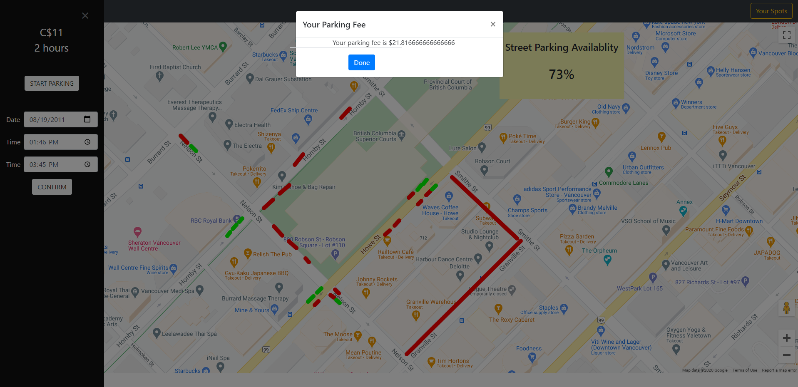
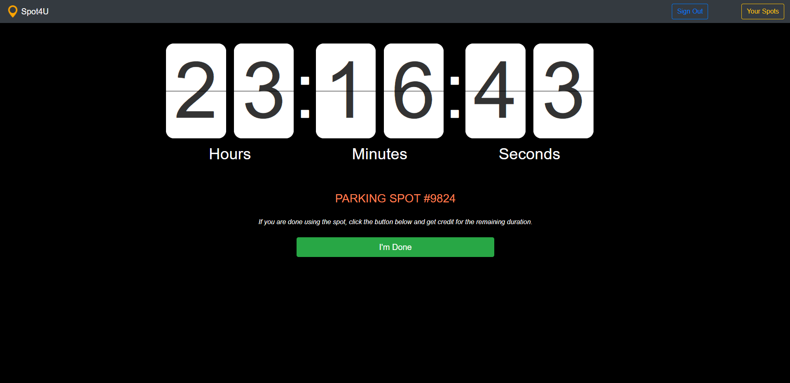
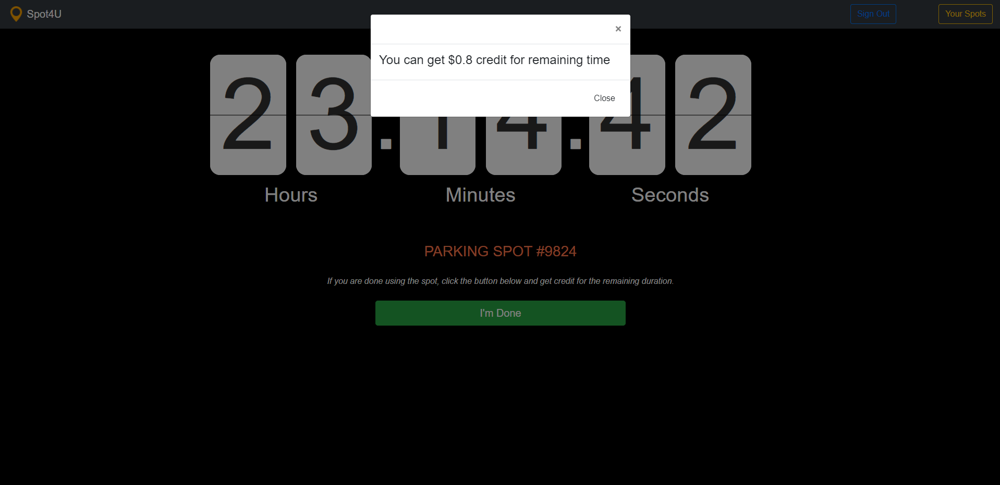

# Spot 4 U
This project is done at 2019 DeCode Congestioon Hackathon by City of the Vancouver.
The project provides users a map to look for available parking positions in Vancouver. 

## Table of contents
* [General info](#general-info)
* [Screenshots](#screenshots)
* [Technologies](#technologies)
* [Features](#features)
* [Status](#status)
* [Contact](#contact)

## General info
This project is created hoping to reduce the time that drivers take to find a parking spot. 
The less time a driver spend on finding a spot the less car there is likely to be on the streets. 
In addition, this project hopes to gain data from vancouver driver's parking usage to
help with future city developments.  

## Screenshots

## Technologies
* HTML & CSS
* Bootstrap
* JavaScript
* Google Maps
* Firebase

## Features
* Find available pakring spots highlighted in green
* See occupied spot highlighted in red
* Collect parking points for any unused time 
* Select and occupy a parking spot by selecting time and date
* View remaining time on their parking spot

## Status
Project is: _finished_

## Contact
Created by:
* [@jasonwei0224](https://github.com/jasonwei0224)
* [@SangwookYun](https://github.com/SangwookYun)
